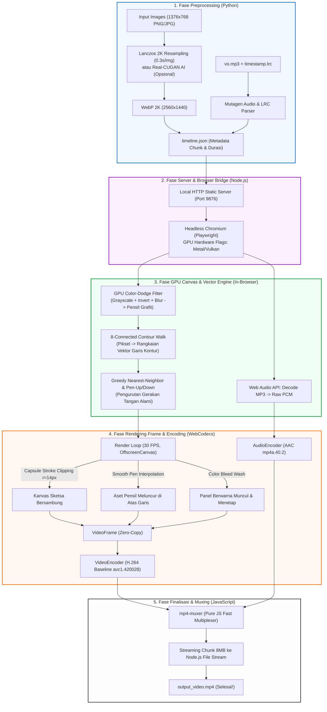

# 📐 Blueprint: Architecture & Pipeline Render Video (WebCodecs + Canvas GPU)

Dokumen ini adalah **arsitektur blueprint** lengkap dari pipeline generator video animasi edukasi / komik faceless. Arsitektur ini dirancang untuk menggantikan stack rendering lama (FFmpeg image-pipe / MoviePy / OpenCV) yang lambat dan boros CPU, menjadi **High-Performance In-Browser Rendering (140+ FPS)** berbasis akselerasi GPU.

---

## 🗺️ Diagram Alur Keseluruhan (End-to-End Flow)

---

## 🛠️ Rincian Teknologi & Metode per Tahapan

### Tahap 1: Preprocessing & Timeline Generator (`process_images.py`)
- **Tujuan**: Menyiapkan aset visual dan menyinkronkan durasi naskah/audio ke dalam struktur data yang siap dikonsumsi renderer.
- **Tools**:
  - `Pillow (PIL)`: Menggunakan filter interpolasi `LANCZOS` untuk memperbesar gambar input ($1376 \times 768$) ke **2K QHD ($2560 \times 1440$) format WebP**.
    - *Kenapa Lanczos 2K?* Pembesaran hanya $1.39\times$, garis tetap tajam tanpa artefak, dan prosesnya hanya **0.3 detik/gambar** (vs 10 detik dengan AI Real-CUGAN).
  - `mutagen.mp3`: Membaca durasi audio `vo.mp3` secara presisi hingga satuan milidetik.
  - `LRC Regex Parser`: Membaca penanda waktu `[mm:ss.xx]` dari file lirik narasi.
- **Output**: File `timeline.json` yang berisi array chunk durasi waktu, path gambar 2K (`fullImage`), dan sub-panel.

---

### Tahap 2: Node.js Orchestrator & Chromium Headless (`render_engine.mjs`)
- **Tujuan**: Menjalankan browser terisolasi dengan akses GPU penuh untuk merender canvas ke hardware encoder.
- **Tools**:
  - `http` (Node Native): Menyediakan server lokal ringan (`http://localhost:9876`) untuk melayani file `timeline.json`, audio, dan gambar tanpa terkena batasan keamanan CORS browser.
  - `playwright` (Chromium): Meluncurkan Chromium headless dengan flag GPU penting:
    - `--enable-webgl`, `--use-gl=angle`, `--enable-features=WebCodecs`.

---

### Tahap 3: Algoritma Whiteboard & Sketsa Pensil (In-Browser GPU)
Tahap ini berjalan 100% di dalam JavaScript browser tanpa library luar:

1. **GPU Color-Dodge Sketch Filter** *(Waktu: ~10 ms)*:
   - Gambar asli diduplikasi ke dua kanvas:
     - `grayCanvas`: grayscale 100%.
     - `invCanvas`: grayscale 100% + invert 100% + gaussian blur 12px.
   - Kanvas digabung menggunakan blend mode `sCtx.globalCompositeOperation = "color-dodge"`.
   - **Hasil**: Efek sketsa pensil grafit bergradasi halus alami tanpa garis patah-patah (bebas dari efek biner 1-bit yang kasar).

2. **8-Connected Contour Walk** *(Ekstraksi Garis Vektor)*:
   - Matriks piksel gelap ditelusuri menggunakan algoritma penelusuran tetangga 8-arah (`[dx, dy] \in \{-1, 0, 1\}`).
   - Piksel dikelompokkan menjadi **rantai kurva bersambung** (*stroke chains*), bukan titik-titik acak.

3. **Greedy Nearest-Neighbor & Pen-Up/Down Detection**:
   - Kurva diurutkan dari yang terdekat dengan ujung pensil saat ini.
   - Jika berpindah objek (jarak $> 55\text{px}$), pensil mengaktifkan status **Pen-Up** (meluncur di udara tanpa mencoret kanvas).
   - Saat berada di dalam kurva yang sama, status **Pen-Down** aktif.

---

### Tahap 4: Rendering Frame & Hardware Encoding (`WebCodecs`)
Setiap frame video ($1/30$ detik) dirender dan di-encode secara instan:

1. **Capsule Stroke Clipping (`revealCapsule`)**:
   - Untuk setiap segmen garis dari $(x_1, y_1)$ ke $(x_2, y_2)$, digambar bentuk geometri kapsul beradius $r = 14\text{px}$ (ketebalan pensil nyata).
   - Area kapsul di-*clip* (`ctx.clip()`), lalu sketsa pensil digambar ke dalamnya. Menghasilkan garis yang tersambung padat tanpa celah lubang / efek lingkaran tap-tap.

2. **Sub-Frame Pencil Interpolation**:
   - Koordinat ujung pensil $(penX, penY)$ dihitung melalui interpolasi linier kontinu di antara dua titik vektor ditambah getaran mikro alami tangan pelukis (`Math.sin(f * 1.8) * 1.8`).

3. **Progressive Persistence & Color Wash**:
   - 4 Panel digambar berurutan ($Q_1 \to Q_2 \to Q_3 \to Q_4$).
   - Panel yang sudah selesai digambar **tetap tinggal di layar berwarna penuh** (`globalAlpha = 1.0`), sehingga penonton dapat membaca dan mengapresiasi keseluruhan komik secara santai.

4. **Zero-Copy VideoFrame**:
   - `new VideoFrame(canvas, { timestamp })` langsung membaca VRAM kanvas browser tanpa konversi buffer CPU.
   - Dikirim ke `VideoEncoder` (`avc1.420028`, H.264 Baseline, bitrate 3.2 Mbps).

---

### Tahap 5: Audio Encoding & MP4 Muxing
- **Audio**: Raw audio PCM di-decode via Web Audio API, dipotong per chunk audio frame, dan di-encode oleh `AudioEncoder` ke format AAC (`mp4a.40.2`).
- **Muxing**: Library `mp4-muxer` (Robert Dyer) menggabungkan chunk H.264 dan AAC secara langsung di memori browser.
- **Disk Streaming**: Buffer video dikirim kembali ke Node.js dalam bongkahan 8MB melalui streaming sinkron agar tidak memenuhi memori RAM.

---

## ⚡ Keunggulan Blueprint Ini Dibanding Metode Konvensional

| Parameter | Metode Tradisional (MoviePy / FFmpeg Image-Pipe) | Blueprint Ini (WebCodecs + Canvas GPU) |
| :--- | :--- | :--- |
| **Kecepatan Render** | 10 – 25 FPS (Lebih lambat dari real-time) | **140 – 160 FPS** (3x – 5x lebih cepat dari durasi aslinya) |
| **Penggunaan CPU/RAM** | 100% CPU spike, boros memori temp files | Rendah & stabil berkat *zero-copy* & *backpressure control* |
| **Efek Visual / Shaders** | Butuh compile shader GLSL kompleks / OpenCV C++ | Cukup manipulasi HTML5 Canvas 2D standar & CSS filters |
| **Portabilitas** | Rumit dependensi binary FFmpeg, codec pack, path OS | Sangat portabel (cukup Node.js + browser Chromium) |
| **Keluwesan Desain** | Sulit membuat animasi pensil dinamis | Sangat mudah karena kanvas mendukung semua fungsi grafis web |

---

## 💡 Cara Mengadaptasi Blueprint Ini ke Proyek Lain

1. **Ganti Logika Gambar**: Ubah fungsi gambar di `OffscreenCanvas` untuk jenis video lain (misalnya: animasi teks lirik karaoke, diagram infografis bergerak, papan tulis matematika, atau slideshow dinamis).
2. **Gunakan `mp4-muxer` + `WebCodecs`**: Pola `VideoEncoder` + `AudioEncoder` + `mp4-muxer` dapat di-copy-paste langsung ke proyek Node.js mana pun yang membutuhkan ekspor video kilat.
3. **Format Aset**: Cukup sediakan gambar dengan aspek rasio 16:9 dan file narasi audio (`.mp3` + `.lrc`).
